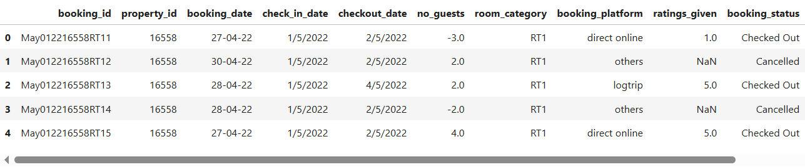
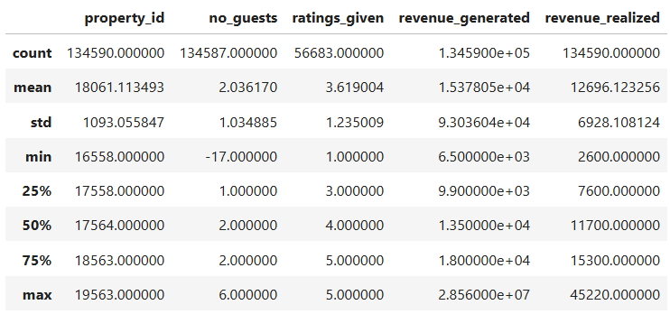
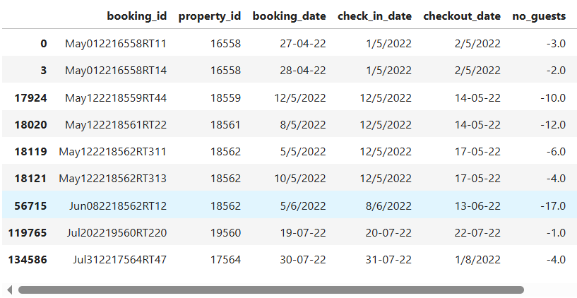
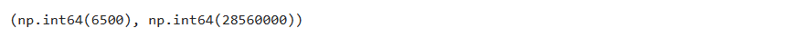

Data science is having a huge impact on the medical field, specifically in the area of cancer studies. In this project I will work with breast cancer data. This project focuses on data analysis using a simple step-by-step explanation.

# Table of Contents
1. [Project Overview](#ch1)
1. [EDA Definition and Steps](#ch2)
1. [Step 1: Data Exploration and Cleaning](#ch3)
1. [Step 2: Head and describe](#ch4)
1. [Step 3: Target distribution](#ch5)
1. [Step 4: Features distribution](#ch6)
1. [Step 5: Correlation matrix](#ch7)
1. [Step 6: Positive correlated features](#ch8)
1. [Step 7: Uncorrelated features](#ch9)
1. [Step 8: Negative correlated features](#ch10)

1. [References](#ch90)


<a id="ch1"></a>
# Project Overview

# **Project Summary from Kaggle:**

# Attribute information:

<a id="ch3"></a>
# Step 1: Data Exploration and Cleaning
We have 5 different .CSV format files and we'll explore them one by one.
```
#Read data
df_bookings = pd.read_csv('data/fact_bookings.csv')
df_bookings.head()
```



I inspected several issues. 'no_guests' column has error values, in our case on the table below we can see the -17.000, but number of guests cannot be zero or less than zero, it has to be a positive number. Furthermore, the 'revenue_generated' column has some issues as well.

```
#quick statistics on the numeric columns in this particular data frame
df_bookings.describe()
```


Checking the negative values of 'no_guests' column gave me around 10 rows which can be ignored in this particular case as the total records number is 134590.
```
#checking how many negative values are in the column no_guests
df_bookings[df_bookings.no_guests<=0]
```


After checking the highest and the lowest revenues for the single booking, the maximum value looks not realistic as the number is so big.
```
#checking the revenue_generated column
df_bookings.revenue_generated.min(), df_bookings.revenue_generated.max()
```



