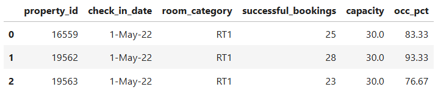

Data science is having a huge impact on the medical field, specifically in the area of cancer studies. In this project I will work with breast cancer data. This project focuses on data analysis using a simple step-by-step explanation.

# Table of Contents
1. [Project Overview](#ch1)
1. [EDA Definition and Steps](#ch2)
1. [Step 1: Data Exploration and Cleaning](#ch3)
1. [Step 2: Data Transformation](#ch4)
1. [Step 3: Data Insights](#ch5)
1. [Step 4: Features distribution](#ch6)
1. [Step 5: Correlation matrix](#ch7)
1. [Step 6: Positive correlated features](#ch8)
1. [Step 7: Uncorrelated features](#ch9)
1. [Step 8: Negative correlated features](#ch10)

1. [References](#ch90)


<a id="ch1"></a>
# Project Overview
On this project the data from different booking websites is represented. 
I performed a comprehensive data analysis for AtliQ Grands using Python.
# **Project Summary:**
AtliQ Grands is a prominent hospitality group operating a chain of five-star hotels across major Indian cities, 
including Delhi, Mumbai, Hyderabad, and Bangalore. With over 20 years in the industry, the company offers 
a diverse portfolio of properties such as AtliQ Seasons, AtliQ Exotica, AtliQ Bay, and AtliQ Palace.
# Attribute information:

<a id="ch3"></a>
# Step 1: Data Exploration and Cleaning
We have 5 different .CSV format files and we'll explore them one by one. 
Using the example of the fact_booking.csv dataset, I demonstrated the process of data exploration and cleaning. 
The handling and analysis of the other datasets are detailed in the accompanying code file. 
```
#Read data
df_bookings = pd.read_csv('data/fact_bookings.csv')
df_bookings.head()
```


I inspected several issues. 'no_guests' column has error values, in our case on the table below we can see the -17.000, but number of guests cannot be zero or less than zero, it has to be a positive number. Furthermore, the 'revenue_generated' column has some issues as well.

```
#quick statistics on the numeric columns in this particular data frame
df_bookings.describe()
```


Checking the negative values of 'no_guests' column gave me around 10 rows which can be ignored in this particular case as the total records number is 134590.
```
#checking how many negative values are in the column no_guests
df_bookings[df_bookings.no_guests<=0]
```


After checking the highest and the lowest revenues for the single booking, the maximum value looks not realistic as the number is so big.
```
#checking the revenue_generated column
df_bookings.revenue_generated.min(), df_bookings.revenue_generated.max()
```


For fixing the outlier issues I am using the standard deviation to detect the lower and higher limits. 
On the table below we can see all the huge numbers for the 'revenue_generated' column which is non-realistic, 
because no one will pay that much for one-night stay.
```
#if the value is more than this it's considered as an outlier
higher_limit = avg + 3*std
higher_limit

#checking the negative values to detect the higher_limits
df_bookings[df_bookings.revenue_generated>higher_limit]
```


Below I checked the total null values in the dataset and only the 'ratings_given' column has such values. 
In this case I didn't assume this as the error because in reality not every single guest is leaving a rating.
```
#handling NA values
df_bookings.isnull().sum()
```


<a id="ch4"></a>
# Step 2: Data Transformation
In this step, I demonstrated how I added an additional column for occupancy percentage using the 
fact_aggregated_bookings.csv dataset. 
The occupancy percentage was calculated by dividing the number of successful bookings by the total capacity.
```
#new column for the occupancy percentage
df_agg_bookings.loc[:, 'occ_pct'] = df_agg_bookings['successful_bookings'] / df_agg_bookings['capacity']

#occupancy in percent form
df_agg_bookings.loc[:, 'occ_pct'] = df_agg_bookings['occ_pct'].apply(lambda x: round(x*100, 2))
df_agg_bookings.head(3)
```


<a id="ch5"></a>
# Step 3: Data Insights
avg_occ by city image
 Insight: Delhi stands out with the highest average room occupancy at 61.6%, noticeably higher than other cities. Bangalore is at the lower end with 56.6%.

🎯 Recommendation: Consider diving into what's driving Delhi’s stronger performance — location demand, pricing strategy, events — and explore whether similar tactics can be applied in other cities.

5. Time Trends: Check-in Date, Week Number, and Day Type
Insight: Analyzing how occupancy and successful bookings change over time (e.g., over weeks, days of the week, or by specific dates) will uncover seasonal trends and peak booking periods.

Analysis:

Calculate average occ_pct and successful_bookings for each week_no, or break down by day_type (weekday vs. weekend).

Visualization:

Line Chart to show trends over time (week_no or check-in date).

Donut Chart or Bar Chart to compare weekday and weekend occupancy.


